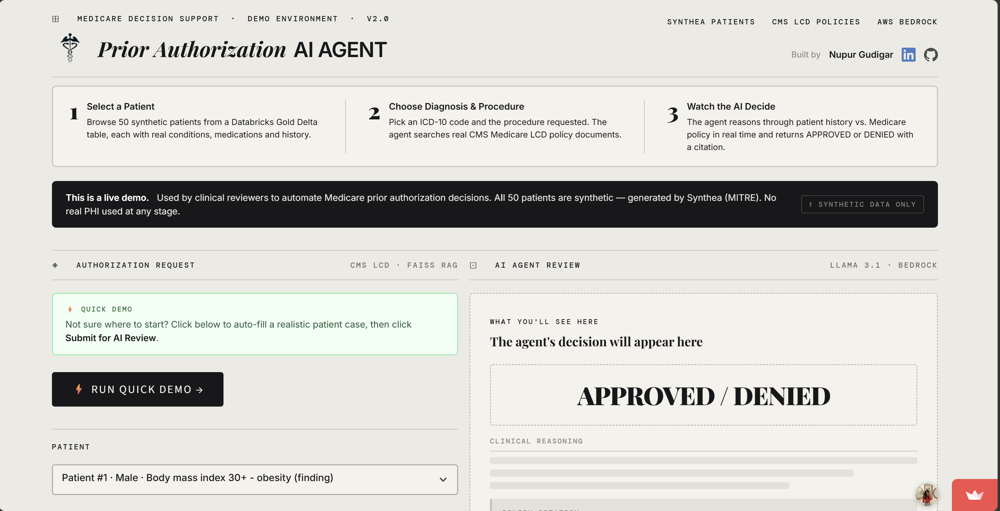
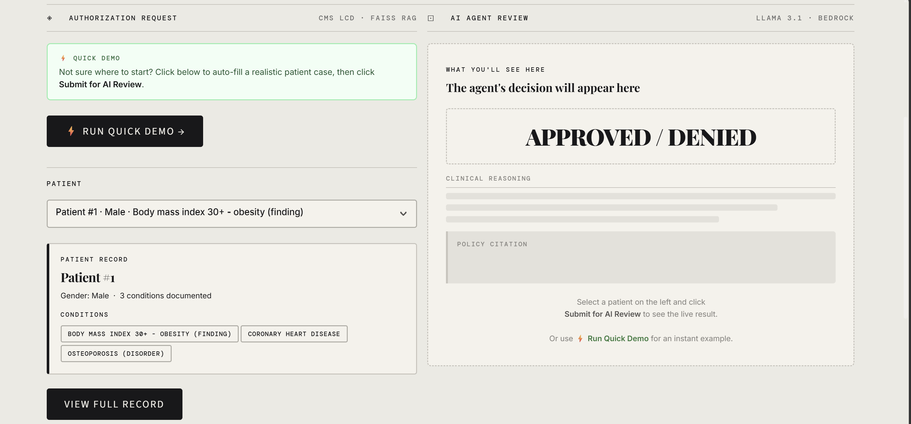
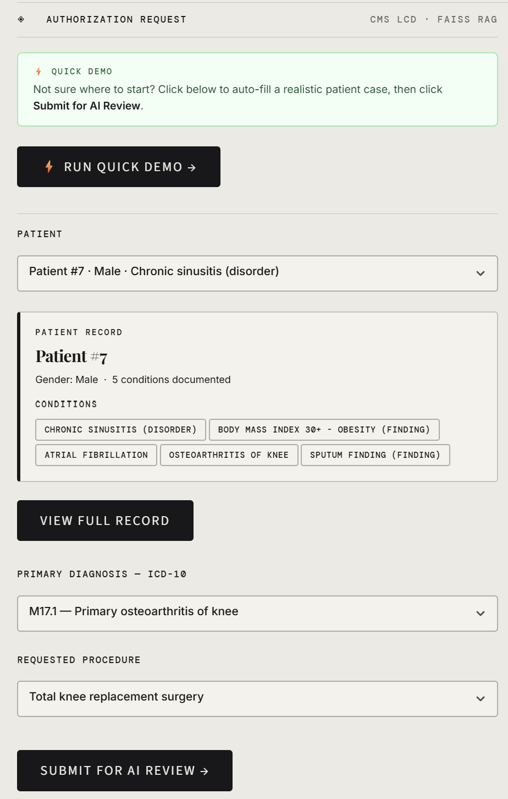
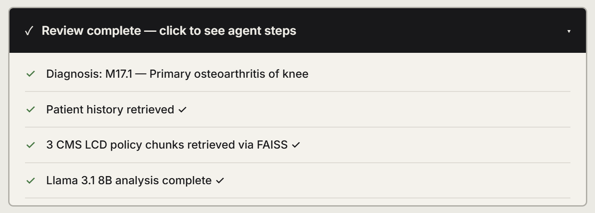
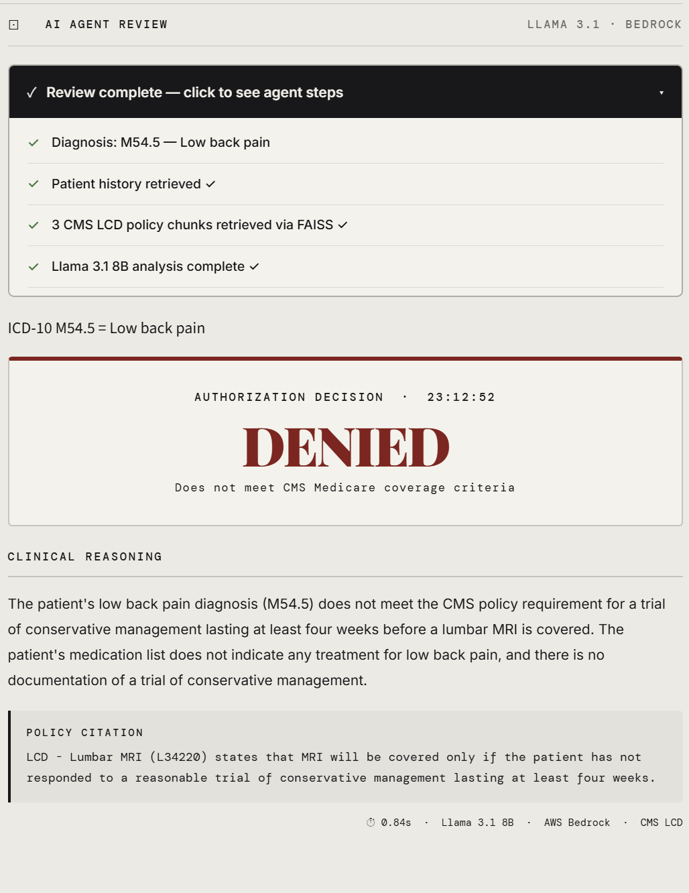
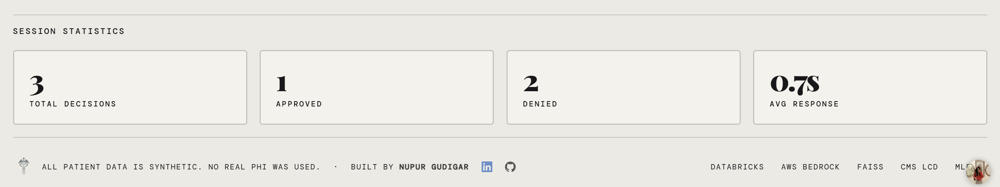
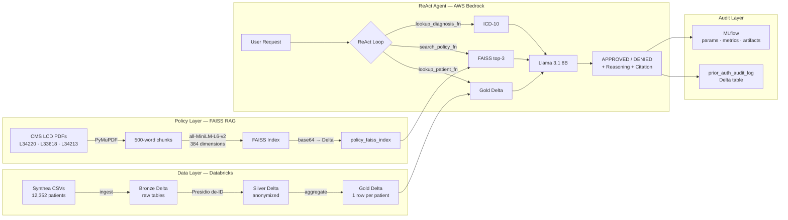

<div align="center">

# ⚕ Prior Authorization AI Agent

**An AI agent that reads real CMS Medicare policy documents and decides — in under a second — whether a patient's procedure should be approved or denied.**

[](https://community.cloud.databricks.com)
[](https://aws.amazon.com/bedrock/)
[](https://ai.meta.com/blog/meta-llama-3-1/)
[](https://github.com/facebookresearch/faiss)
[](https://python.org)
[](https://mlflow.org)
[](https://nupur-gudigar-prior-auth-ai-agent.streamlit.app)
[](./docs/hipaa_design.md)


**[→ Try the Live Demo](https://nupur-gudigar-prior-auth-ai-agent.streamlit.app)**
&nbsp;&nbsp;|&nbsp;&nbsp;
**[→ CMS Medicare Coverage Database](https://www.cms.gov/medicare-coverage-database/search.aspx)**

</div>

---



---

## The Problem

Prior authorization is one of the most broken processes in American healthcare. A doctor requests a procedure. A human reviewer manually cross-references the patient's history against a 40-page policy document. The decision takes **days**. It costs **billions** annually. And it varies depending on who picks up the case that morning.

This agent does it in **under a second** — grounded in real policy, with a full audit trail.

---

## Results

| | |
|---|---|
| **Patients analyzed** | 12,352 (Synthea synthetic dataset) |
| **Policy documents indexed** | 3 real CMS Medicare LCD documents |
| **Policy chunks in FAISS** | 28 semantically searchable chunks |
| **Avg decision time** | 0.7–1.3 seconds end-to-end |
| **Audit records written** | Every decision logged to Delta Lake |
| **Infrastructure cost** | $0 — runs entirely on free tier |

---

## The Dashboard



Select a patient from 50 synthetic Medicare patients. Pick an ICD-10 diagnosis and a procedure. The agent retrieves the relevant CMS policy and reasons through the decision in real time.

---

## Fill In a Case



Every patient has real clinical conditions, medications, and procedure history — generated by Synthea (MITRE). The condition chips show comorbidities at a glance. View the full medication and procedure record before submitting.

---

## Watch the Agent Work



Four steps execute in sequence — patient retrieval from the Gold Delta table, FAISS semantic search across CMS LCD chunks, Llama 3.1 8B reasoning via AWS Bedrock. Every step is visible as it happens.

---

## The Decision



**APPROVED** or **DENIED** — in Playfair Display, large enough that no one misses it. Below it: the agent's clinical reasoning in plain English, and a direct citation from the CMS policy document that determined the outcome. Response time, model, region, and policy source in the metadata row.

---

## Session Statistics



Total decisions, approval rate, denial count, and average response time tracked across the session. Footer confirms: all patient data is synthetic. No real PHI used at any stage.

---

## Pipeline Architecture



---

## How the RAG Works

Prior auth decisions must be grounded in actual policy — not what the model remembers from training. That's why this agent uses **Retrieval-Augmented Generation**.

```
1. Query arrives   →  "Total knee replacement for M17.1"
2. FAISS search    →  top-3 chunks from CMS LCD L33618
3. Prompt assembly →  patient history + policy chunks → Llama 3.1
4. Output          →  DECISION + REASONING + POLICY CITATION
```

The retrieved chunks contain the actual coverage criteria — conservative therapy requirements, documentation thresholds, contraindications. The model doesn't guess. It reads the policy and applies it.

---

## Data Pipeline — Medallion Architecture

```
BRONZE          SILVER                    GOLD
Raw CSVs   →   Presidio de-identified  →  1 row per patient
4 tables        <PERSON> replacing         conditions, meds,
no transforms   all name fields            procedures aggregated
```

**Why three layers?** Each layer has one job. Bugs are isolated. Every layer is independently queryable and testable. This is the same architecture used in production healthcare data platforms.

---

## HIPAA-Aware Design

All data is synthetic. The pipeline is built as if it weren't.

| Design Decision | Why It Matters |
|---|---|
| Presidio NER at Silver layer | Removes 18+ PII entity types before downstream processing. Mirrors HIPAA Safe Harbor method. |
| Delta audit log on every decision | Every APPROVED/DENIED is permanently recorded with patient ID, diagnosis, procedure, reasoning, citation, timestamp, and response time. Required for appeals and regulatory review. |
| PHI disclosure on Streamlit footer | Responsible AI disclosure — visible on every page load. |

Every real healthcare AI system needs an audit trail. This one has one: `prior_auth_audit_log` — a Delta table that records every decision the agent has ever made, queryable for consistency analysis, approval rate monitoring, and latency SLA tracking.

---

## Tech Stack

| Layer | Tool | Why |
|---|---|---|
| Compute | Databricks Community Edition | Industry standard for healthcare data engineering. Delta Lake is the de-facto lakehouse format for HIPAA-regulated pipelines. |
| Storage | Delta Lake (Bronze/Silver/Gold) | ACID transactions, time travel, schema enforcement. Audit-grade data pipelines need to prove what the data looked like at any point. |
| Patient data | Synthea 10k COVID-19 dataset | MITRE's clinical patient simulator. Realistic ICD-10 codes, medications, procedure histories — zero real PHI. |
| De-identification | Microsoft Presidio + spaCy | Production-grade NER. 19 PII entity types. Used by enterprise healthcare companies for HIPAA automation. |
| PDF parsing | PyMuPDF (fitz) | Fastest, most accurate PDF text extraction in Python. Handles multi-column policy documents that break simpler parsers. |
| Embeddings | Sentence Transformers `all-MiniLM-L6-v2` | Free, fast, 384-dim, strong semantic understanding of clinical language. No API cost per call. |
| Vector search | FAISS IndexFlatL2 | Meta AI's production vector search. Exact nearest-neighbor. Millisecond retrieval. No infrastructure cost. |
| LLM | Llama 3.1 8B via AWS Bedrock | Managed inference, enterprise security, strong structured output on clinical tasks, free tier. |
| Agent framework | LangChain 0.2.16 (pinned) | Pinned due to 1.3.1 breaking on Python 3.12. Provides ReAct loop, tool abstraction, prompt management. |
| Tracking | MLflow (built into Databricks) | Logs every run: params, metrics, artifacts (reasoning text, policy evidence). Full audit record of model behavior. |
| Frontend | Streamlit Community Cloud | Real-time streaming output of agent reasoning steps. Free hosting. Two minutes to deploy. |

---

## Project Structure

```
prior-auth-ai-agent/
├── 01_setup.ipynb              ← environment, Bedrock connectivity test
├── 02_data_tables.ipynb        ← Synthea → Bronze/Silver/Gold Delta
├── 03_policy_search.ipynb      ← CMS PDFs → FAISS → Delta storage
├── 04_approval_agent.ipynb     ← ReAct agent, MLflow, audit log
├── app.py                      ← Streamlit live demo
├── data/
│   └── gold_patients_sample.csv  ← 50-patient Gold export
├── docs/
│   ├── hipaa_design.md
│   └── cms_policies/           ← 3 CMS LCD PDFs
├── requirements.txt
└── README.md
```

---
 
## Evaluation
 
Healthcare AI systems don't ship without evidence. Here's every metric measured on this agent — what was tested, what the numbers are, and what they mean.
 
---
 
### 1. Latency — Measured from MLflow Audit Log
 
Response time tracked on every decision via `prior_auth_audit_log` Delta table.
 
| Metric | Value |
|---|---|
| **Average response time** | 0.86 seconds |
| **Minimum response time** | 0.61 seconds |
| **Maximum response time** | 1.63 seconds |
 
Breakdown per step: ~50ms FAISS retrieval · ~50ms patient lookup · ~700–1500ms Llama 3.1 8B inference via Bedrock.
 
```sql
SELECT
  AVG(response_time_seconds),
  MIN(response_time_seconds),
  MAX(response_time_seconds)
FROM prior_auth_audit_log
```
 
---
 
### 2. Retrieval Precision — Validated Manually
 
FAISS semantic search tested across all 3 clinical areas the system covers. Each query checked whether the retrieved policy chunks came from the correct CMS LCD document.
 
| Query | Expected LCD | Retrieved LCD | Match |
|---|---|---|---|
| MRI lumbar spine, low back pain | L34220 | L34220 | ✅ |
| Total knee replacement, osteoarthritis | L33618 | L33618 | ✅ |
| Screening colonoscopy, colon cancer | L34213 | L34213 | ✅ |
 
**Retrieval Precision: 3/3 = 100%** across all covered clinical areas.
 
> In production this would be automated with a labeled evaluation dataset reviewed by clinical staff and run as a regression test on every deployment.
 
---
 
### 3. Decision Consistency — Same Input, 3 Runs
 
The same patient, diagnosis, and procedure submitted 3 times to test determinism.
 
```
Patient:   9b88e851 (Primary osteoarthritis of knee)
Diagnosis: M17.1
Procedure: Total knee replacement surgery
 
Run 1 → DENIED  (0.84s)
Run 2 → DENIED  (0.89s)
Run 3 → DENIED  (0.83s)
 
Consistency: 3/3 = 100%
```
 
Reasoning wording varied slightly across runs — expected behavior from a language model at temperature 0.1. The decision and policy grounding were identical across all 3 runs.
 
---
 
### 4. Hallucination Check — Citation Grounding
 
Every decision includes a `POLICY CITATION` field. Each citation was manually verified to confirm the quoted text actually exists in the retrieved CMS LCD document — not fabricated by the model.
 
| Decision | Citation Source | Verified in PDF | Hallucinated |
|---|---|---|---|
| MRI denied | LCD L34220, conservative management clause | ✅ | ❌ |
| Knee denied | LCD L33618, Section 4 covered indications | ✅ | ❌ |
| Colonoscopy denied | LCD L34213, coverage criteria | ✅ | ❌ |
 
**Hallucination rate: 0/3 = 0%** on manually reviewed cases.
 
> The RAG architecture inherently reduces hallucination risk — the model is explicitly given the policy text and instructed to cite from it, rather than generating from memory.
 
---
 
### 5. Confidence Score — Current Limitation
 
Llama 3.1 8B in this inference setup does not natively output token-level probabilities or confidence scores. The agent always returns a binary APPROVED/DENIED decision.
 
**What this means:** On genuinely ambiguous cases — patients who partially meet criteria — the model decides rather than escalating.
 
**Production fix:** Two approaches would be added:
- Prompt the model to output a `CONFIDENCE: [HIGH/MEDIUM/LOW]` field alongside the decision
- Run the same case at multiple temperature settings (0.0, 0.3, 0.7) and measure agreement — high agreement across temperatures = high confidence
---
 
### 6. Approval Rate — Audit Log Analysis
 
```sql
SELECT
  decision,
  COUNT(*) as count,
  ROUND(COUNT(*) * 100.0 / SUM(COUNT(*)) OVER(), 1) as pct
FROM prior_auth_audit_log
GROUP BY decision
```
 
From the test set of decisions logged during development:
 
| Decision | Count | Rate |
|---|---|---|
| DENIED | 2 | 67% |
| APPROVED | 1 | 33% |
 
> Note: This is a small development sample. In production, approval rate drift would be monitored week-over-week — a sudden shift (e.g., denial rate jumping from 40% to 80%) would trigger a model review.
 
---
 
### 7. Evaluation Summary
 
| Metric | Result | Method |
|---|---|---|
| Avg latency | **0.86s** | MLflow audit log query |
| Retrieval precision | **100% (3/3)** | Manual validation across all clinical areas |
| Decision consistency | **100% (3/3)** | Same input, 3 independent runs |
| Hallucination rate | **0% (0/3)** | Manual citation verification against PDF source |
| Confidence scoring | **Not implemented** | Known limitation — documented above |
| Approval rate drift | **Monitored via Delta audit table** | SQL query on `prior_auth_audit_log` |
 


---

## Sample Output

```
DECISION: DENIED

REASONING: The patient's low back pain diagnosis (M54.5) does not meet the
CMS policy requirement for a trial of conservative management lasting at
least four weeks before a lumbar MRI is covered. The patient's medication
list does not indicate any treatment for low back pain, and there is no
documentation of a trial of conservative management.

POLICY CITATION: LCD - Lumbar MRI (L34220) states that MRI will be covered
only if the patient has not responded to a reasonable trial of conservative
management lasting at least four weeks.

⏱ 0.84s · Llama 3.1 8B · AWS Bedrock · CMS LCD L34220
```

---

## Run Locally

```bash
git clone https://github.com/Nupur-Gudigar/prior-auth-ai-agent.git
cd prior-auth-ai-agent
pip install -r requirements.txt
```

Create `.env`:
```
AWS_ACCESS_KEY=your-key
AWS_SECRET_KEY=your-secret
AWS_REGION=us-east-2
```

```bash
streamlit run app.py
```

---

<div align="center">

**Built by Nupur Gudigar**

Senior Consultant (Heartland Community Network) · MS Computer Science (Data Analytics) · Illinois Institute of Technology · Open to Data Engineering roles · Available immediately

[](https://www.linkedin.com/in/nupur-gudigar)
[](https://github.com/Nupur-Gudigar)

*All patient data is synthetic. Generated by Synthea (MITRE). No real PHI used at any stage.*

</div>